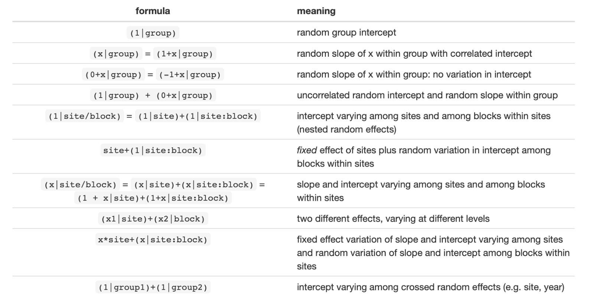

```{r setup, include=FALSE}
knitr::opts_chunk$set(echo = TRUE,
                      message = FALSE,
                      warning = FALSE)
```

# Importando os pacotes

Vamos importar alguns pacotes até o final dessa aula, porém vamos trabalhar na base tidyverse. O tidyverse é um pacote que contém vários pacotes que auxiliam na manipulação de dados e construção de gráficos. Um exemplo que vamos usar é o pipe (%>%) do pacote magrittr, que faz parte do tidyverse. Assim como o pacote `dplyr` para manipulaccção de dados.

```{r}
library(tidyverse)
```

# Dados 

Parte dos resultados de [Confirmation and control of HPPD-inhibiting herbicide–resistant waterhemp (Amaranthus tuberculatus) in Nebraska](https://maxweeds.rbind.io/pdf/2017-confirmation-wat.pdf) de Oliveira et al. (2017). Nove herbicidas pré-emergentes aplicados em milho. Os estudos foi conduzido em campo em 2013 e 2014.

Vamos usar o pacote `RCurl` para baixar o pacote via GitHub.

```{r}
library(RCurl)
```

```{r}
# Baixando via GitHub
df_path <- url("https://raw.githubusercontent.com/maxwelco/workshop-esalq/main/data/residual.csv")

# Lendo via read_csv
residual <- read_csv(df_path)

residual
```


# Manipulação dos dados

O resultado (control), % de controle de planta daninha (`waterhemp`) está em uma escala de 0 a 100, precisamos colocar em uma escala entre 0 e 1 (proporção)

```{r}
residual1 <- residual %>% 
  mutate(control_prop = control / 100)

residual1
```

Pronto! Os dados de controle estão na escala de proporção. Porém existem vários 0 e 1. Devemos eliminar o 0 e 1 e mudar para 0.001 e 0.999, respectivamente.

```{r}
residual2 <- residual1 %>% 
  mutate(control_prop = case_when(
    control_prop == 1.00 ~ 0.999,
    control_prop == 0.00 ~ 0.001,
    TRUE                 ~ control_prop
  ))

residual2
```

Agora sim, os dados estão prontos!

Mas antes um pequeno ajuste

```{r}
residual3 <- residual2 %>%
  mutate_if(is_character, as_factor) %>% 
  mutate_at(c("year", "trt", "rep"), as_factor)

residual3
```

O que fiz foi mudar as colunas de `character` (nomes) para `fctr` (fator) usando a função *mutate_if* e alguns colunas `dbl` (números) para `fctr`. 


# Visualização de dados

Sempre visualize seus dados antes de proceder com a análise estatística. Aqui vamos usar o pacote `ggplot` do grupo `tidyverse`. Você já importou o pacote `ggplot` via `tidyverse`.

## Gráfico de pontos 

Aqui plotei um gráfico bem simples para visualizar a dispersão dos dados de controle de planta daninha em dois anos.

```{r}
ggplot(residual3, aes(x = herbicide, y = control_prop, color = year)) + 
  geom_point() +
  coord_flip() +
  ylim(0, 1)
```

## Gráfico box-plot

Na figura abaixo adicionei um box-plot para melhorar a visualização da dispersão dos dados. 

```{r}
ggplot(residual3, aes(x = herbicide, y = control_prop, color = year)) + 
  geom_boxplot() + # veja que adicionei esse código para gerar o box plot
  geom_point() +
  coord_flip() +
  ylim(0, 1)
```

Aqui mostrei uma pequena parte do que pode ser feito com a parte de visuazlição exploratória de dados. Existe n possibilidades. Com o `ggplot` é possivel fazer figuras fantásticas! Duvida? Veja isso aqui: [TidyTuesday Bookmarks](https://www.notion.so/Data-Viz-Bookmarks-dc01718020bd4fd6a8a4ca80e6bce933).


# ANOVA

## Premissas da ANOVA 

- Normalidade (Distribuição Gausseana)

- Homogeneidade de variância

- Independência

## Normalidade

Percentagem são dados tecnicamente não normalizados e vamos usar beta distribution.


## Homogeneidade de variâncias

Aqui vamos usar a função `leveneTest` para verificar a homogeneidade de variâncias entre os anos. 

```{r}
library(car)
leveneTest(control_prop ~ year, data = residual3)
```

Note que o P-valor é significativo, tecnicamente não poderia juntar os anos. Mas nessa análise vou juntar para facilitar. 

* Definir juntar ou não dados de anos/locais distintos usando estatística é sempre uma discussão e não vamos entrar nesse mérito aqui.

## Independência

Relacionado como foi conduzido o estudo e como coletou os dados.


## Modelo

```{r}
library(glmmTMB)
```


```{r}
modelo <- glmmTMB(control_prop ~ # variável resposta
                    herbicide + # variável fixa
                    (1|rep/year), # efeitos randomizados
                  family = beta_family(link = "logit"),
                  REML = FALSE,
                  data = residual3)
```

### Efeitos randomizados




## Anova

```{r}
glmmTMB:::Anova.glmmTMB(modelo)
```

Pronto! Executamos o modelo e a ANOVA. O resultado diz que herbicide é significativo `Pr(>Chisq) = 2.018e-10 ***`.

Temos que avaliar o desempenho dos herbicidas no controle da planta daninha!


# Avaliando o controle da planta daninha com herbicidas

Vamos usar o pacote `emmeans`

```{r}
library(emmeans)
```

Primeira visualização usando a funccção `emmip`. Note que no código tem um atributo `type="response"`, que faz a transformação dos dados de volta para a proporção (controle). 

```{r}
emmip(modelo, ~ herbicide, type="response") + coord_flip()
```

## Médias marginais estimadas (médias dos quadrados mínimos)

A lsmeans forneceram os valores com o controle de plantas daninhas (prop), SE (erro padrão) e intervalos de confiança (lower.CL e upper.CL). Além disso, lsmeans fornece os contrastes aos pares entre tratamentos (herbicidas).

```{r}
lsmeans <- emmeans(modelo, # modelo
                   ~ herbicide, # efeito fixo
                   cont="pairwise", # tipo de comparação
                   type="response", # transforma os dados de volta ao original
                   alpha=0.05) # nivel 

lsmeans
```

## Visualizar as médias de controle

```{r}
plot(lsmeans, # lsmeans
     ~ herbicide, # efeito fixo
     comparisons = TRUE, # quero comparar
     type="response", # transforma os dados de volta ao original
     alpha=0.05, # nivel
     adjust="none") # ajuste, pode ser Tukey por exemplo - None = Fisher LSD
```

O ponto preto é a média do controle do herbicida e o roxo é o intervalo de confiança. A seta vermelha é uma comparação entre tratamentos; se uma seta vermelha não se sobrepõe, os tratamentos são diferentes.


#@ Separação por médias

Vamos usar o pacote `multcomp`

```{r}
library(multcomp)
```


```{r}
cld <- cld(lsmeans$emmeans, # o uso do $emmeans filtra o resultado de lsmeans para as medias
           alpha=0.05, # nivel
           Letters=letters, # usar letras
           adjust="none", # sem ajuste de medias
           reversed = TRUE) # a ---> z
cld
```


Pronto! Sua análise está feita. Existe n possibilidades de reportar esses dados. Você pode criar uma tabela ou usar figuras, segue algumas sugestões abaixo.

# Reportando os dados


```{r}
ggplot(cld, aes(x=reorder(herbicide, response), y= response * 100, color = herbicide)) + 
  geom_point(size=4) + 
  geom_linerange(aes(ymin = lower.CL*100, ymax = upper.CL*100), size=1.5) + 
  ylim(0,100) +
  labs(y="Waterhemp control (%)", x="") +
  theme_bw() +
  theme(axis.title = element_text(size=16),
        axis.text = element_text(size=15),
        legend.position = "none") +
 coord_flip() 
```

```{r fig.width=10}
ggplot(cld, aes(x=herbicide, y=response * 100, fill=herbicide, label=.group)) + 
  geom_bar(stat="identity") + 
  ylim(0,110) +
  labs(y="Waterhemp control (%)", x="Herbicides") +
  geom_text(nudge_y = 7, nudge_x = 0, size = 8) + 
  theme_bw() +  
  theme(legend.position = "none")
```

## Tabela

Vamos usar o pacote `kableExtra`

```{r}
library(kableExtra)
```


```{r}
kable(cld) %>%
  kable_styling()
```


# Leitura complementar

- Kniss et al. [Stats4ag](https://rstats4ag.org/)

- Bates et al. [Fitting Linear Mixed-Effects Models Using lme4](https://cran.r-project.org/web/packages/lme4/vignettes/lmer.pdf)

- [Getting started with emmeans](https://aosmith.rbind.io/2019/03/25/getting-started-with-emmeans/)


