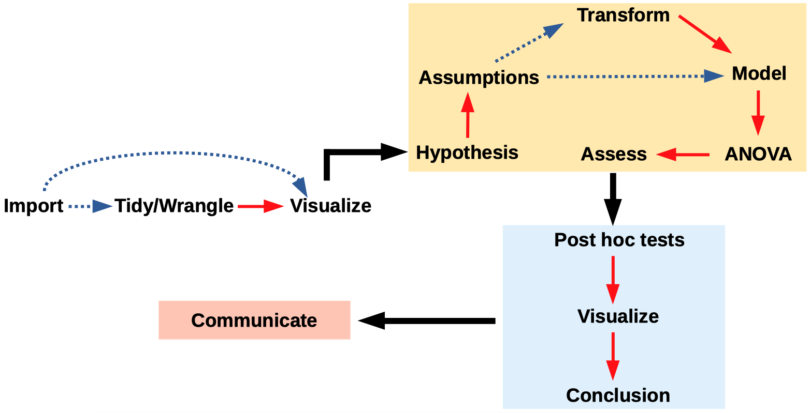
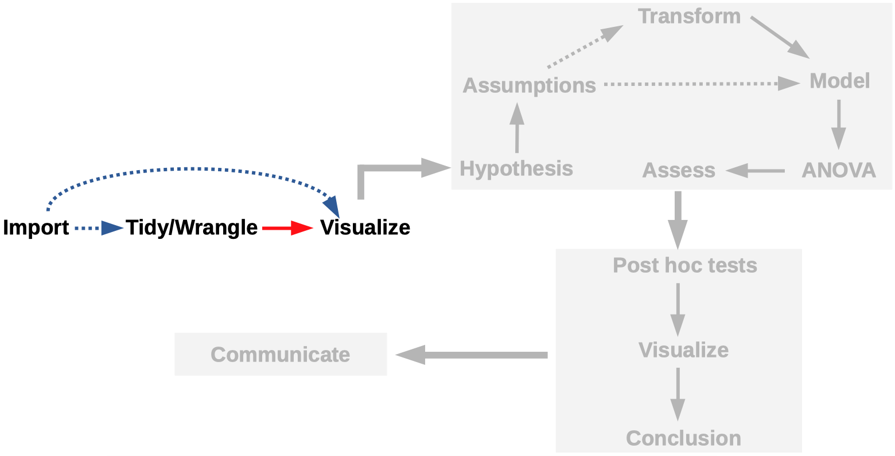
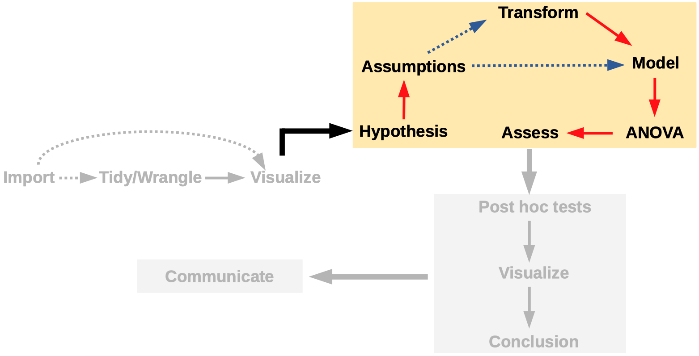
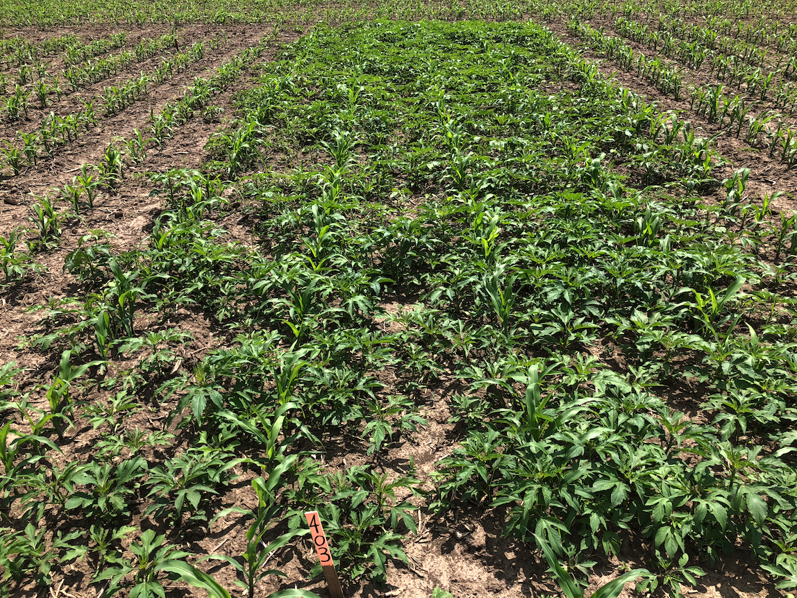
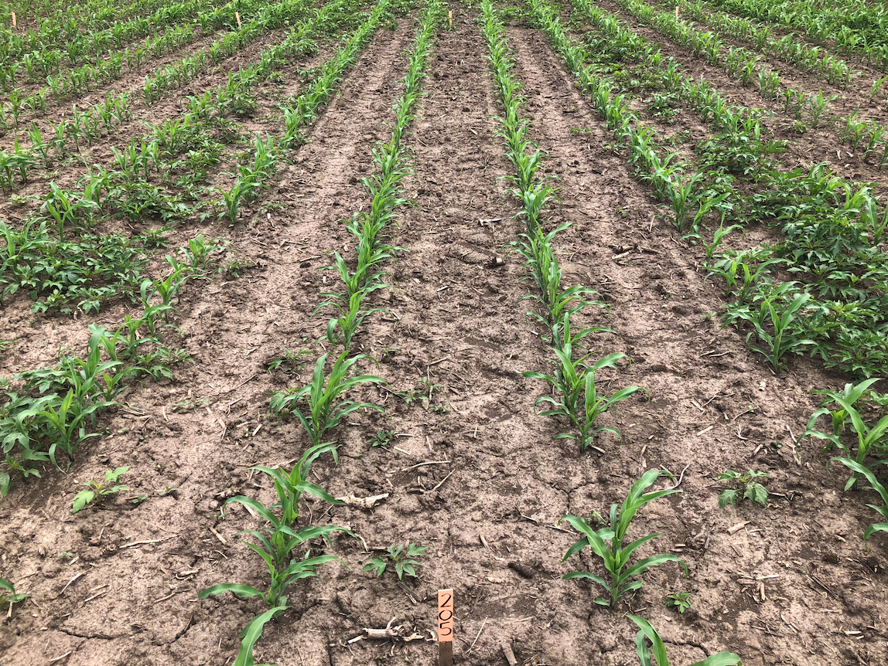
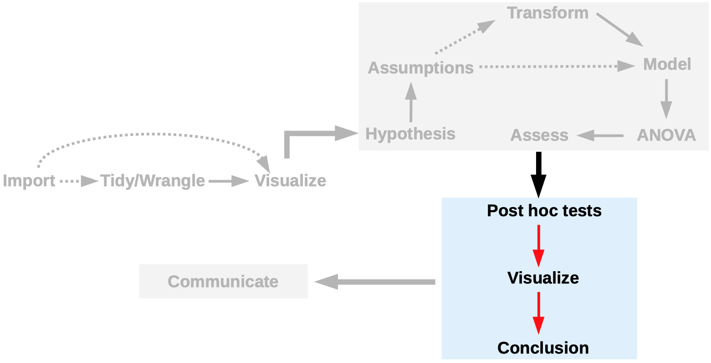
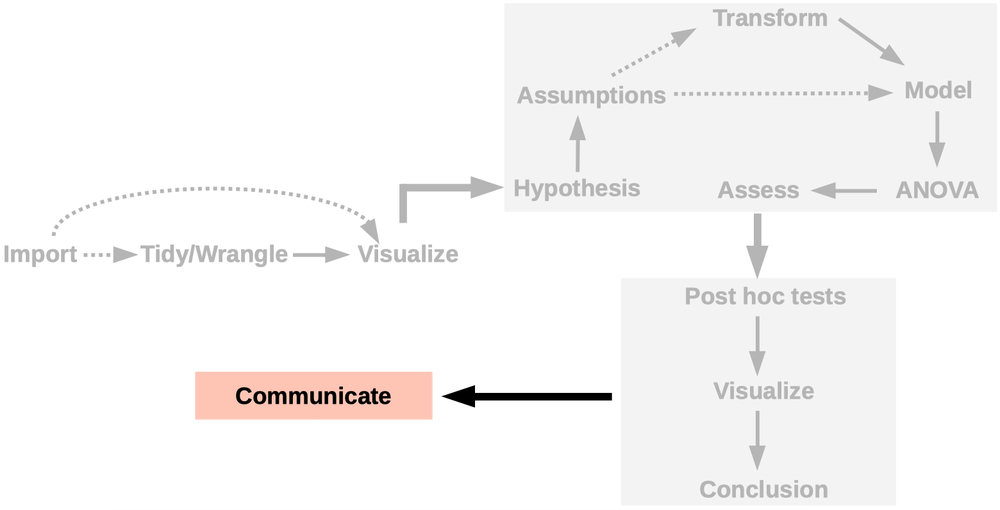

```{r setup, include=FALSE}
options(htmltools.dir.version = FALSE)
knitr::opts_chunk$set(
  fig.width=9, fig.height=3.5, fig.retina=3,
  out.width = "100%",
  cache = FALSE,
  echo = TRUE,
  message = FALSE, 
  warning = FALSE,
  hiline = TRUE
)
```


```{r include=FALSE}
library(tidyverse)
library(icons)
library(countdown)
```


```{r xaringan-themer, include=FALSE, warning=FALSE}
library(xaringanthemer)
style_duo_accent(
  primary_color = "#5D3FD3",
  secondary_color = "#FF961C",
  white_color = "#FAF9F6",
  black_color = "#333333",
  inverse_header_color = "#333333",
  inverse_background_color = "#CCCCFF",
  table_row_even_background_color = lighten_color("#CCCCFF", 0.8),
)
```

class: inverse middle center

# About me


---

class: middle, center

## Maxwel Coura Oliveira


[`r icon_style(fontawesome("github"), style = "solid")` @maxwelco](https://github.com/maxwelco)  
[`r icon_style(fontawesome("twitter"), style = "solid")` @maxwelco](https://twitter.com/maxwelco)  
[`r icon_style(fontawesome("link"), style = "solid")` maxweeds.rbind.io](https://maxweeds.rbind.io)  
[`r icon_style(fontawesome("envelope-square"), style = "solid")` maxwelco@gmail.com](mailto:maxwelco@gmail.com)

???

- I am on the social media. Please fee free to follow me

- Describe my social media

- My blog, github, twitter


---

background-image: url(https://upload.wikimedia.org/wikipedia/commons/a/aa/Youngronaldfisher2.JPG)
background-position: right
background-size: contain

# Análise de variância

--

1) ANOVA

--

2) Usado para analisar as diferenças entre as médias <br> dos grupos em uma amostra

--


.footnote[Fonte: Wikipedia]


---

# Análise de variância


```{r echo=FALSE, out.width=900}

```

---

# Modelos mistos


- "Um modelo misto, modelo de efeitos mistos ou modelo de componente de erro misto é um modelo estatístico que contém efeitos fixos e efeitos aleatórios"

    - **Efeitos fixos**: tratamento aplicado

    - **Efeitos aleatórios**: repetição, bloco, ano, mês, animal


---


background-image: url(https://source.unsplash.com/HLOWpeN68G4)
background-position: left
background-size: contain

.pull-right[
# Dados

1) PRE-emergência

2) waterhemp (*Amaranthus tuberculatus*)

3) Estudo de campo em dois anos no cultivo de milho


.footnote[Oliveira et al. 2017]
]

---

# Dados

```{r include=FALSE}
library(RCurl)
library(tidyverse)
df_path <- getURL("https://raw.githubusercontent.com/maxwelco/workshop-esalq/main/data/residual.csv")
# Lendo via read_csv
residual <- read_csv(df_path)
```

```{r echo=FALSE}
DT::datatable(
  head(residual, 10),
  fillContainer = FALSE, options = list(pageLength = 8)
)
```


---

# Manipulação de dados


```{r echo=FALSE, out.width=900}

```

---

# Manipulação de dados

- Muitas vezes precisamos ajustar os dados antes de iniciar a análise estatística


.pull-left[

]

--

.pull-right[
```{r echo=FALSE, out.width=300, fig.align='center'}
knitr::include_graphics("https://englelab.gatech.edu/useRguide/images/dplyr_logo.png")
```


]


---

# Visualização


> "O gráfico simples trouxe mais informações à mente do analista de dados do que qualquer outro dispositivo." John Tukey
```{r echo = FALSE, out.width=500, fig.align='center'}
knitr::include_graphics("https://media.giphy.com/media/3oKIPEqDGUULpEU0aQ/giphy.gif")
```

---

## Sua vez

- Você vai trabalhar com os dados de controle de plantas daninhas em pós emergência

- Vá em exercícios --> ANOVA e faça do número **1**.

```{r echo=FALSE, out.width=400}
knitr::include_graphics("https://media.giphy.com/media/12XDYvMJNcmLgQ/giphy.gif")
```


```{r echo =FALSE}
countdown(minutes = 1, seconds = 00)
```

---

# Revisão

- Pense em **y_** como uma variável de resposta e trt como tratamentos

- Com base no que aprendemos sobre a escala correta (dica: proporções) para uma variável de resposta para nossa análise de dados


| trt 	| rep 	| y_1 	| y_2  	| y_3  	| y_4  	|
|-----	|-----	|-----	|------	|------	|------	|
| A   	| 1   	| 5   	| 0.05 	| 5    	| 0.05 	|
| B   	| 2   	| 20  	| 0.20 	| 0.20 	| 20   	|
| C   	| 3   	| 50  	| 0.50 	| 50   	| 0.50 	|
| D   	| 4   	| 40  	| 0.40 	| 40   	| 0.40 	|


- Qual dessas colunas de variáveis de resposta tem **y_** em uma escala correta?

---

# Hipótese


```{r echo=FALSE, out.width=900}

```

---


# Hipótese


**H0:** os herbicidas têm o mesmo desempenho no controle de planta daninha

vs

**HA:** herbicidas têm desempenho diferente no controle de planta daninha


.pull-left[
```{r echo=FALSE, out.width=400}

```

]

.pull-right[
```{r echo=FALSE, out.width=400}

```


]


---

# Premissas da ANOVA

.pull-left[
- Independência

- Distribuição normal (gaussiana)

- Homogeneidade da variância
]

.pull-right[

]


---

# Modelo

- Generalized linear mixed models (GLMMs) and extensions, built on Template Model Builder

- Gaussiano, Poisson, binomial, binomial negativo, **Beta** etc

```{r}
#install.packages("glmmTMB", type="source")
library(glmmTMB)
```

- Beta: não é possível lidar com os valores 0 (0%) e 1 (100%)

- ANOVA

---

# Sua vez

- Você vai trabalhar com os dados de controle de plantas daninhas em pós emergência

- Vá em exercícios --> ANOVA e faça do número **2, 3 e 4**.

```{r echo=FALSE, out.width=400}
knitr::include_graphics("https://media.giphy.com/media/yoJC2K6rCzwNY2EngA/giphy.gif")
```


```{r echo =FALSE}
countdown(minutes = 3, seconds = 00)
```

---

# Pós ANOVA


```{r echo=FALSE, out.width=900}

```

---

# Pós ANOVA

- Depende dos resultados da ANOVA

- Usamos o pacote `emmeans` para estimar as médias marginais

```{r}
#install.packages("glmmTMB", type="source")
library(glmmTMB)
```

- Usamos o pacote `multicomp` para estimar as diferenças dos tratamentos com letras

```{r}
#install.packages("multcomp")
library(multcomp)
```

---


# Sua vez

- Você vai trabalhar com os dados de controle de plantas daninhas em pós emergência

- Vá em exercícios --> ANOVA e faça do número **5, 6, 7 e 8**.

```{r echo=FALSE, out.width=400}
knitr::include_graphics("https://media.giphy.com/media/3oKIP8C4lSWT47ZBHW/giphy.gif")
```


```{r echo =FALSE}
countdown(minutes = 5, seconds = 00)
```


---

# Apresentação dos resultados

```{r echo=FALSE, out.width=900}

```

---

# Apresentação dos resultados

.pull-left[
- Gráfico

- Tabela
]


.pull-right[
```{r echo = FALSE, out.width= 700}
knitr::include_graphics("https://media.giphy.com/media/g9wbFB61YEh1u/giphy.gif")
```
]

---

# Sua vez

- Você vai trabalhar com os dados de controle de plantas daninhas em pós emergência

- Vá em exercícios --> ANOVA e faça do número **9 e 10**.

```{r echo=FALSE, out.width=400}
knitr::include_graphics("https://media.giphy.com/media/oGO1MPNUVbbk4/giphy.gif")
```


```{r echo =FALSE}
countdown(minutes = 2, seconds = 00)
```


---

name: goodbye
class: right, middle, blue


# Thank you!

#### You can find me at...

[`r icon_style(fontawesome("github"), style = "solid")` @maxwelco](https://github.com/maxwelco)  
[`r icon_style(fontawesome("twitter"), style = "solid")` @maxwelco](https://twitter.com/maxwelco)  
[`r icon_style(fontawesome("link"), style = "solid")` maxweeds.rbind.io](https://maxweeds.rbind.io)  
[`r icon_style(fontawesome("envelope-square"), style = "solid")` maxwelco@gmail.com](mailto:maxwelco@gmail.com)