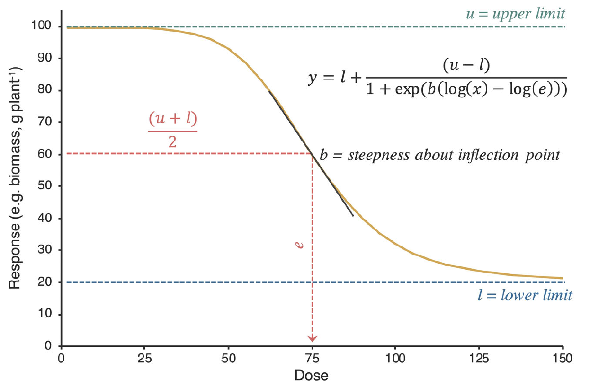

```{r setup, include=FALSE}
knitr::opts_chunk$set(echo = TRUE,
                      message = FALSE,
                      warning = FALSE,
                      fig.align = 'center')
```

# Dose resposta

Essa figura representa uma típica curva de dose resposta:

<center>

{width="70%"}

</center>

Nesse caso a figura representa a resposta de doses de herbicidas em uma planta.

# Importando os pacotes

Vamos importar alguns pacotes até o final dessa aula, porém vamos trabalhar na base tidyverse. O tidyverse é um pacote que contém vários pacotes que auxiliam na manipulação de dados e construção de gráficos. Um exemplo que vamos usar é o pipe (%>%) do pacote magrittr, que faz parte do tidyverse. Assim como o pacote `dplyr` para manipulaccção de dados.

```{r}
library(tidyverse)
options(scipen=TRUE)
```

# Dados

Parte dos resultados de [Inheritance of mesotrione resistance in an Amaranthus tuberculatus (var. rudis) population from Nebraska, USA](https://maxweeds.rbind.io/pdf/2018-inheritance-wat.pdf) de Oliveira et al. (2018).

Vamos usar o pacote `RCurl` para baixar o pacote via GitHub.

```{r}
library(RCurl)
```

```{r}
# Baixando via GitHub
df_path <- url("https://raw.githubusercontent.com/maxwelco/workshop-esalq/main/data/dose_resposta.csv")

# Lendo via read_csv
dose <- read_csv(df_path)

dose
```

| Colunas | Significado                           |
|---------|---------------------------------------|
| biotype | biótipo                               |
| run     | repetição dos experimentos            |
| rep     | replicação das unidades experimentais |
| rate    | dose do herbicida                     |
| control | \% de controle de planta daninha      |
| biomass | biomassa seca 21 dias após tratamento |

# Visualização de dados

Sempre visualize seus dados antes de proceder com a análise estatística. Aqui vamos usar o pacote `ggplot` do grupo `tidyverse`. Você já importou o pacote `ggplot` via `tidyverse`.

## Gráfico de pontos

```{r}
ggplot(dose, aes(x = rate, y = control, color = biotype)) + 
  geom_point() +
  ylim(0, 100)
```

## Gráfico de dispersão

```{r}
ggplot(dose, aes(x = factor(rate), y = control, color = biotype)) + 
  geom_boxplot()
```

# Modelo

```{r}
library(drc)
```

```{r}
model <- drm(control ~ # variável resposta
               rate, # variável explanatória
             biotype, # fatores
             fct = l4(), # curva usada (existem várias)
             data = dose) # onde estão os dados
```

Veja em detalhes os modelos que podem ser usados aqui [DRC CRAN](https://cran.r-project.org/web/packages/drc/drc.pdf) <https://cran.r-project.org/web/packages/drc/drc.pdf>). Existem várias equações que podem ser usadas em dose-resposta. Qual a melhor? Depende de seus dados!

No [DRC CRAN](https://cran.r-project.org/web/packages/drc/drc.pdf) você encontra todas as informações do pacote `drc`. Vale a pena explorá-lo antes de começar a usar o pacote.

## Parâmetros

A função `tidy` mostra os parâmetros da equação usada: l4 (4 parâmetros log-logistic).

```{r}
broom.mixed::tidy(model)
#tidy é uma função do pacote broom.mixed
```

| **Parâmetro** | Significado                |
|---------------|----------------------------|
| b             | inclinação                 |
| c             | limite inferior            |
| d             | limite superior            |
| e             | ponto de infecção da curva |

Existe um problema com o resultado de um dos parâmetros!

<center>

{width="40%"}

</center>

> Visualize o limite superior! É possível isso ocorrer biologicamente?

## Visualizando o modelo

O pacote `drc` possui a função `plot` que pode ser usada junto com o modelo usado. Veja abaixo.

```{r fig.width=6}
plot(model)
```

Você pode adicionar vários atributos na função `plot` como cores, legendas, tamanho etc. Veja como no `CRAN do drc`. Mas a função `plot` é obseleta no sentido de reportar a figura. Porém, muito usada para rápida visualização de adequação do modelo usado.

## Gerando valor a sua análise

### EDs

A função `ED` do pacote *drc* gera a dose na qual causa 50 ou 90% de controle da planta daninha. Veja que aqui a variável resposta é % de controle de plantas daninhas.

```{r}
ED(model, c(50, 90), interval = "delta")
```

```{r}
ED(model, c(50, 90), interval = "delta",
   type = "absolute")
```

Observe que os resultados mudam (e muito!) quando usamos `type = "absolute"`. Existem duas tipos aqui `type = "absolute"` ou `type = "relative"`. Tipo relativo é o padrão usado, então quando usamos a função `ED` sem o atributo type, o resultado será relativo. Relativo ao limite superior da curva. Por outro lado, quando especificamos `type = "absolute"`, o resultado será o valor absoluto especificado, como 50 ou 90% de controle (valores do eixo-y).

Se quiser ver todos os atributos para a função `ED`, escreva no *console* **?ED().** Vai aparecer em *Help* todas as informações. Isso é válido para qualquer função no R.

É muito importante saber diferenciar os tipos de EDs. Cuidado!

<center>

{width="30%"}

</center>

### Comparando os EDs

função `EDcomp` faz comparações entre os EDs. Por exemplo, a código abaixo compara a dose efetiva para causar 50% de injúrias (controle) do herbicida nos biótipos de planta daninhas.

```{r}
EDcomp(model, c(50, 50), type = "absolute")
```

Se você se lembrar, estamos com dois biótipos de plantas daninhas: R e S. Nesse caso uma população estudada é suspectível (S) ao herbicida e a outra resistênte (R). Os resultados nos dão confiança que o efeito do herbicida nos dois biótipos são diferentes. Por exemplo, o fator de resistêcia é 22 (p-value = 0.019189)

Você também pode comparar os quatros parâmetros entre os biótipos. Veja como no CRAN do *drc.*

# Gráfico

```{r}
# gerar uma novo dataset
nd <- expand.grid(rate=exp(seq(log(0.5), log(1680), length=1680)),
                       biotype = c("S", "R"))

# predict the model
pm <- predict(model, newdata=nd, interval="confidence")

# predict intervalo de confiança
nd$p <- pm[,1] 
nd$pmin <- pm[,2] 
nd$pmax <- pm[,3] 

# ajustando o 0
dose$rate0 <- dose$rate
dose$rate0[dose$rate==0] <- 0.5
```

```{r}
ggplot(dose, aes(x = rate, y = control, 
                 color = biotype,
                 fill = biotype)) + 
  geom_line(data=nd, aes(x=rate, y=p, 
                         linetype = biotype), 
            size=1.3) +
  geom_ribbon(data=nd, aes(x=rate, y=p, ymin=pmin, ymax=pmax, 
                           color = NULL),
              alpha=0.2) +
  theme_bw() +
  coord_trans(x="log") +
  scale_x_continuous(breaks=c(0, 1, 5, 12, 26, 53, 105, 
                              210, 420, 840, 1680))
```

# Leitura complementar

- Keshtkar et al. (2021) [Perspective: common errors in dose–response analysis and how to avoid them](https://onlinelibrary.wiley.com/doi/10.1002/ps.6268#.YA3QmAXaO1k.twitter)

-   Knezevic et al. (2007) [Utilizing R Software Package for Dose-Response Studies: The Concept and Data Analysis](https://www.jstor.org/stable/pdf/4495946.pdf)

- Ritz et al. (2015) [Dose-Response Analysis Using R](https://journals.plos.org/plosone/article?id=10.1371/journal.pone.0146021)


