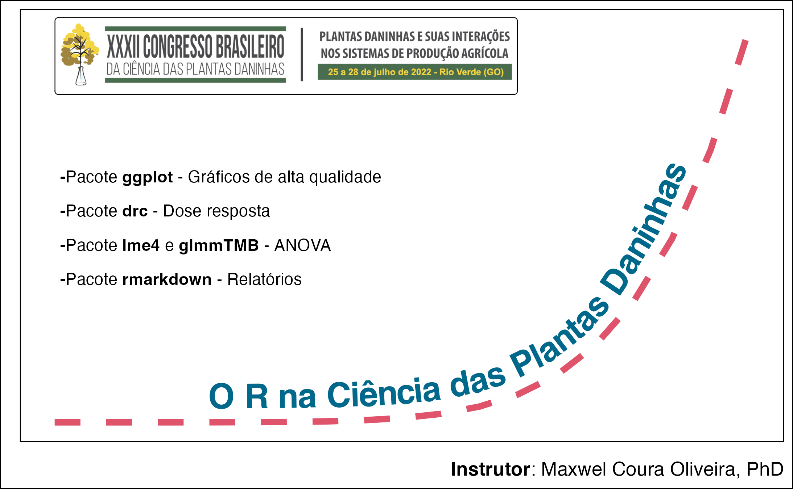

```{r setup, include=FALSE}
knitr::opts_chunk$set(echo = FALSE)

# Learn more about creating websites with Distill at:
# https://rstudio.github.io/distill/website.html

# Learn more about publishing to GitHub Pages at:
# https://rstudio.github.io/distill/publish_website.html#github-pages

```

# Workshop

<center>

</center>


# Cronograma


Dia 25/06/2021 das 13 às 17h.

| Horário        	| Curso         	|
|----------------	|---------------	|
| 14:00 às 14:15 	| Introdução  	  |
| 14:15 às 14:30 	| Dose resposta	  |
| 14:30 às 17:00 	|          	      |


* Intervalos programados durante o período


# Atividade preliminar

- Leia a apostila de **Introdução** e faça o exercício de **Introdução** antes do inicio do curso.


# Open Weed Science

Esse mini-curso faz parte do projeto Open Weed Science.

<iframe width='1000px' height='1000px' src='https://www.openweedsci.netlify.app/' >
</iframe>