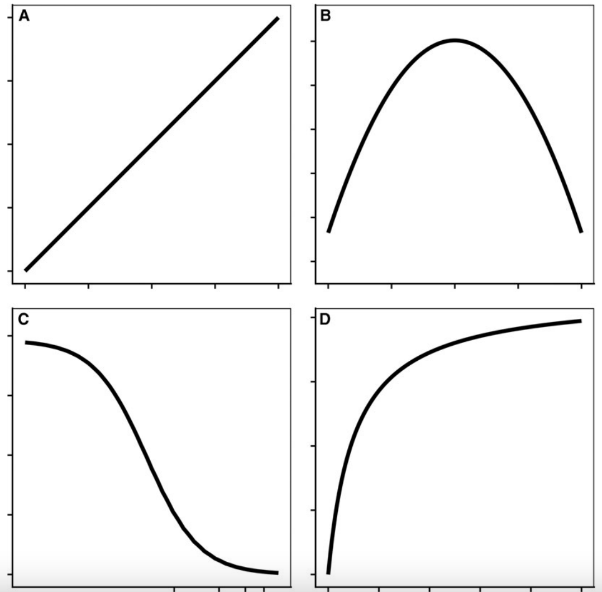
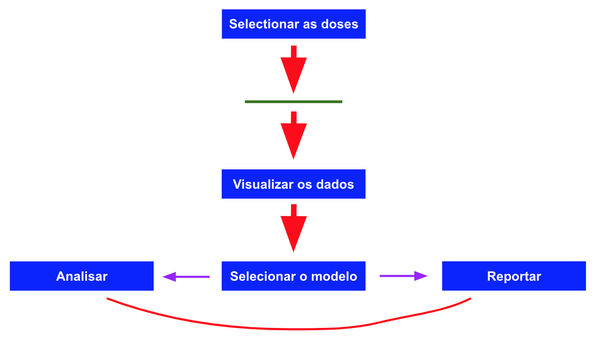

```{r setup, include=FALSE}
options(htmltools.dir.version = FALSE)
knitr::opts_chunk$set(
  fig.width=9, fig.height=3.5, fig.retina=3,
  out.width = "100%",
  cache = FALSE,
  echo = TRUE,
  message = FALSE, 
  warning = FALSE,
  hiline = TRUE
)
```


```{r include=FALSE}
library(tidyverse)
library(icons)
library(countdown)
```


```{r xaringan-themer, include=FALSE, warning=FALSE}
library(xaringanthemer)
style_duo_accent(
  primary_color = "#5D3FD3",
  secondary_color = "#FF961C",
  white_color = "#FAF9F6",
  black_color = "#333333",
  inverse_header_color = "#333333",
  inverse_background_color = "#CCCCFF",
  table_row_even_background_color = lighten_color("#CCCCFF", 0.8),
)
```

# Curvas

<center>

</center>


---

class: middle left
background-image: url(https://upload.wikimedia.org/wikipedia/commons/2/25/Aureolus_Theophrastus_Bombastus_von_Hohenheim_%28Paracelsus%29._Wellcome_V0004455.jpg)
background-position: right
background-size: contain

# Dose

.blockquote[
"Todas as coisas são venenosas e não são <br> venenosas; apenas a dose torna uma coisa <br> não um venenosa" — Paracelsus (1494 - 1541)
]


.footnote[Fonte: Wikipedia]


---

# Dose resposta

```{r echo=FALSE, out.width=700}

```

---

# Dose resposta

<center>

</center>

.footnote[Keshtkar et al. (2021)]

---

# Dose resposta no R

- Pacote `drc`

```{r}
#install.packages("drc")
library(drc)
```

- Clique aqui para baixar o CRAN: [Package drc](https://cran.r-project.org/web/packages/drc/drc.pdf)

- Principais tipos de análises

    - Dose resposta de herbicidas
    
    - Emergeência de plantas daninhas
    
    - Período crítico de competição de plantas daninhas

---

# Dados

- Dose resposta de um estudo investigando resistência à herbicidas

    - 2 biótipos
    
    - 10 doses de mesotrione
    
- Parte dos dados apresentados em Oliveira et al. 2018, [Inheritance of Mesotrione Resistance in an Amaranthus tuberculatus (var. rudis) Population from Nebraska, USA](https://www.frontiersin.org/articles/10.3389/fpls.2018.00060/full)

<center>

</center>


---

# Dados

```{r include=FALSE}
library(RCurl)
library(tidyverse)
df_path <- getURL("https://raw.githubusercontent.com/maxwelco/workshop-esalq/main/data/dose_resposta.csv")

# Lendo via read_csv
dose <- read_csv(df_path)
```


```{r echo=FALSE}
DT::datatable(
  head(dose, 10),
  fillContainer = FALSE, options = list(pageLength = 8)
)
```

---

# Manipulação de dados

- Muitas vezes precisamos ajustar os dados antes de iniciar a análise estatística


.pull-left[
<center>

</center>
]

--

.pull-right[
<center>

</center>

]

---

# Visualização


> "O gráfico simples trouxe mais informações à mente do analista de dados do que qualquer outro dispositivo." John Tukey

<center>

</center>


---

# Modelo

- Qual modelo escolher? Existem vários

<center>

</center>

---

# Modelo

- **Por exemplo**: log-logistico de 4 parâmetro


$$Y = c + \frac{d - c} {1 + exp[b(log x - log e)]}$$
<br>

--


| **Parâmetro** | Significado                |
|:---------------:|:----------------------------:|
| b             | inclinação                 |
| c             | limite inferior            |
| d             | limite superior            |
| e             | ponto de inflecção da curva |


.footnote[Knezevic et al. (2007)]

---


## Sua vez

- Você vai trabalhar com os dados de biomassa

- Vá em exercícios --> Dose resposta e faça do número **1 ao 3**.


<center>

</center>


```{r echo =FALSE}
countdown(minutes = 3, seconds = 00)
```


---

# Interpretando os parâmetros


.pull-left[ 
- Dose efetiva (`ED`): relativa e absoluta

```python
ED()
```

- Como comparar as doses efetivas?

```python
EDcomp
```


]


.pull-right[

```{r include=FALSE}
model <- drm(control ~ # variável resposta
               rate, # variável explanatória
             biotype, # fatores
             fct = l4(), # curva usada (existem várias)
             data = dose) # onde estão os dados
```

```{r echo=FALSE, fig.align='center', out.height=500, out.width=500}
plot(model, legendPos = c(3, 95))
```
]

---

# Sua vez

- Você vai trabalhar com os dados de biomassa

- Vá em exercícios --> Dose resposta e faça do número **4 ao 5**.

<center>

</center>


```{r echo =FALSE}
countdown(minutes = 3, seconds = 00)
```


---

# Figura

```{r include=FALSE}
# gerar uma novo dataset
nd <- expand.grid(rate=exp(seq(log(0.5), log(1680), length=1680)),
                       biotype = c("S", "R"))

# predict the model
pm <- predict(model, newdata=nd, interval="confidence")

# predict intervalo de confiança
nd$p <- pm[,1] 
nd$pmin <- pm[,2] 
nd$pmax <- pm[,3] 

# ajustando o 0
dose$rate0 <- dose$rate
dose$rate0[dose$rate==0] <- 0.5
```


```{r echo = FALSE, out.height=500, out.width=500}
ggplot(dose, aes(x = rate, y = control, 
                 color = biotype,
                 fill = biotype)) + 
  geom_line(data=nd, aes(x=rate, y=p, 
                         linetype = biotype), 
            size=1.3) +
  geom_ribbon(data=nd, aes(x=rate, y=p, ymin=pmin, ymax=pmax, 
                           color = NULL),
              alpha=0.2) +
  theme_bw() +
  coord_trans(x="log") +
  scale_x_continuous(breaks=c(0, 1, 5, 12, 26, 53, 105, 
                              210, 420, 840, 1680))
```


---


# Sua vez

- Você vai trabalhar com os dados de biomassa

- Vá em exercícios --> Dose resposta e faça do número **6**.

<center>

</center>


```{r echo =FALSE}
countdown(minutes = 3, seconds = 00)
```